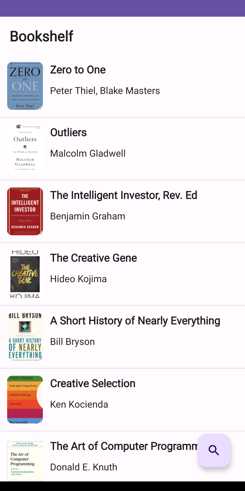
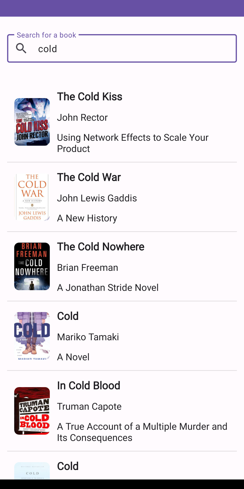
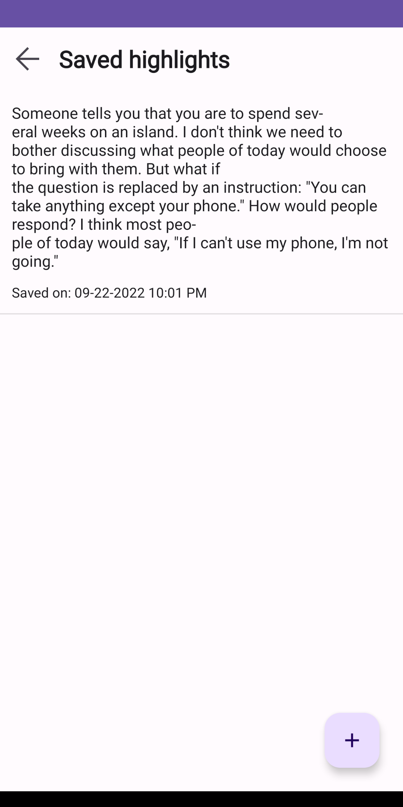
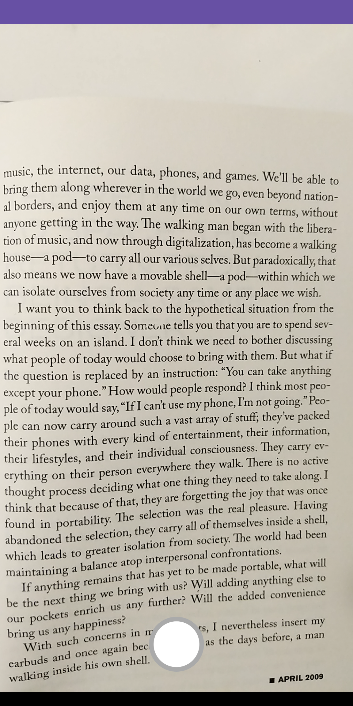
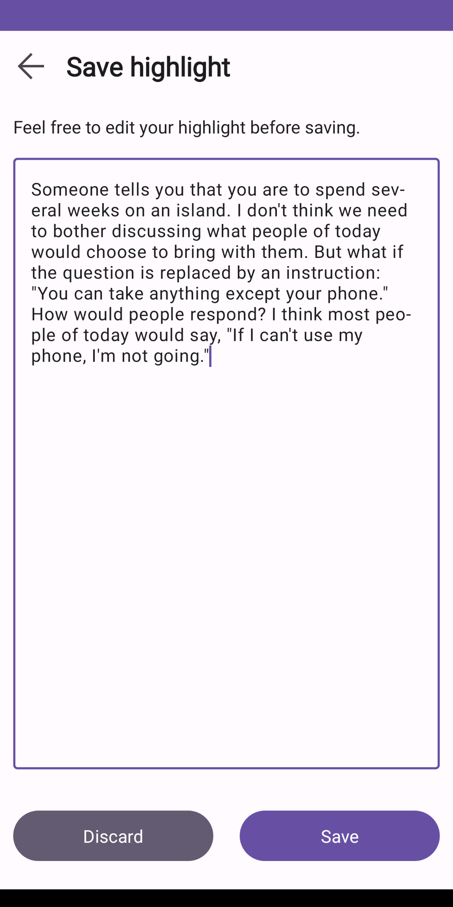

#  Prose

Prose is an Android app to capture and save highlights from physical books.

The app uses the [Google Play Books API](https://developers.google.com/books) to search for a book
and obtain rich content for the same. Books can be saved into a bookshelf and highlights can be
added for each saved book. Image capture capability is enabled
using [CameraX](https://developer.android.com/training/camerax) and text recognition is performed
on-device using [ML Kit](https://developers.google.com/ml-kit/vision/text-recognition/android).

Saved books and highlights are persisted locally using Room for offline availability.

<table border="0">
  <tr>
    <td></td>
    <td></td>
    <td></td>
    <td></td>
    <td></td>
    <td></td>
  </tr>
</table>

## Building the project

The project requires a Google Books API key that needs to be added to a `apikey.properties` file in the `core-network` module.

## License

```
    Copyright 2022 Sriniketh Ramachandran

    Licensed under the Apache License, Version 2.0 (the "License");
    you may not use this file except in compliance with the License.
    You may obtain a copy of the License at

        http://www.apache.org/licenses/LICENSE-2.0

    Unless required by applicable law or agreed to in writing, software
    distributed under the License is distributed on an "AS IS" BASIS,
    WITHOUT WARRANTIES OR CONDITIONS OF ANY KIND, either express or implied.
    See the License for the specific language governing permissions and
    limitations under the License.
```
