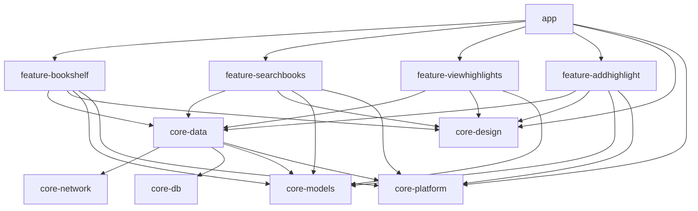
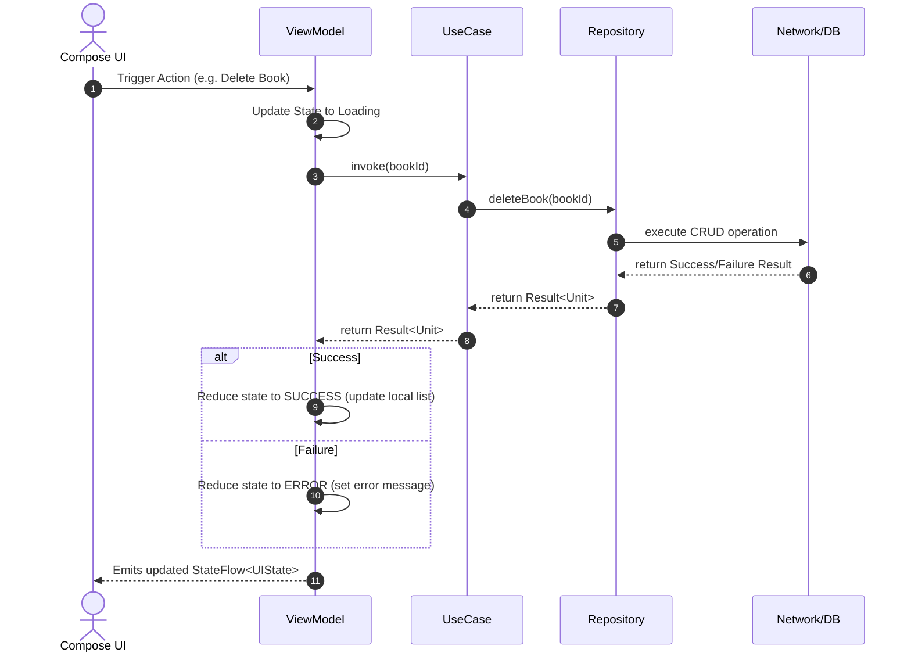

# Architecture Guide

This guide details the architectural design and patterns of Prose.

## Multi-Module Project Structure

Prose is structured as a multi-module Android project to enable separation of concerns, faster build times, and high reusability of core features. 

### Module Dependency Graph



### Module Responsibility Reference

| Module Type | Module Name | Responsibility | Key Components |
| :--- | :--- | :--- | :--- |
| **App** | `app` | Coordinates high-level application lifecycle, binds dynamic features together, and manages global navigation. | [MainActivity](../app/src/main/java/com/sriniketh/prose/MainActivity.kt), [ProseAppScreen](../app/src/main/java/com/sriniketh/prose/ProseAppScreen.kt), [Navigation](../app/src/main/java/com/sriniketh/prose/Navigation.kt) |
| **Feature** | `feature-bookshelf` | Renders the primary bookshelf screen showing all books saved locally in the database. | `BookshelfScreen`, `BookshelfViewModel` |
| **Feature** | `feature-searchbooks` | Searches online for books and shows a detail card of a specific book before adding it to the shelf. | `SearchBookScreen`, `BookInfoScreen` |
| **Feature** | `feature-viewhighlights` | Displays highlights associated with a book, with options to delete or export highlights. | `ViewHighlightsScreen`, `ViewHighlightsViewModel` |
| **Feature** | `feature-addhighlight` | Operates the camera view, handles custom image cropping, performs on-device OCR, and saves the new highlight. | `CaptureAndCropImageScreen`, `EditAndSaveHighlightScreen`, `TextAnalyzer` |
| **Core** | `core-data` | Mediates data fetching between network and database layers. Exposes Domain-level Repositories and UseCases. | `BooksRepository`, `HighlightsRepository`, [usecases](../core-data/src/main/java/com/sriniketh/core_data/usecases/) |
| **Core** | `core-db` | Configures local SQL persistence via Room, providing data structures and CRUD operations. | [BookDatabase](../core-db/src/main/java/com/sriniketh/core_db/BookDatabase.kt), [BookDao](../core-db/src/main/java/com/sriniketh/core_db/dao/BookDao.kt), [HighlightDao](../core-db/src/main/java/com/sriniketh/core_db/dao/HighlightDao.kt) |
| **Core** | `core-network` | Manages external integrations (e.g. Google Books API) via Retrofit and Moshi JSON parsing. | `BooksApi`, `BooksRemoteDataSource` |
| **Core** | `core-models` | Defines pure Kotlin domain models used across features and core libraries. **No Android dependencies.** | `Book`, `Highlight`, `BookSearch` |
| **Core** | `core-design` | Stores shared design guidelines, common top bars, placeholding assets, and UI theme customization. | `Typography`, `Theme`, `Color` |
| **Core** | `core-platform` | Encompasses device/OS features like file access utilities, date formattings, and URI encoding. | `FileSource`, `DateTimeSource`, `UriExtensions` |

---

## Unidirectional Data Flow (UDF)

Prose follows a Unidirectional Data Flow pattern. Events flow upstream from the user interface to state containers (ViewModels), which trigger domain use cases. Results from repositories flow downstream, updating the state, which Compose renders.



---

## Dependency Injection (Hilt)

Dagger Hilt handles dependency injection across all modules.

1. **`core-network`**:
   * [NetworkModule](../core-network/src/main/java/com/sriniketh/prose/core_network/di/NetworkModule.kt) provides the `OkHttpClient`, `Retrofit` client, and `BooksApi` instances.
2. **`core-db`**:
   * [DatabaseModule](../core-db/src/main/java/com/sriniketh/core_db/dagger/DatabaseModule.kt) configures the Room database client and provides [BookDao](../core-db/src/main/java/com/sriniketh/core_db/dao/BookDao.kt) and [HighlightDao](../core-db/src/main/java/com/sriniketh/core_db/dao/HighlightDao.kt).
3. **`core-data`**:
   * [DataModule](../core-data/src/main/java/com/sriniketh/core_data/di/DataModule.kt) binds repository interfaces to implementations (e.g., binds `BooksRepository` to `BooksRepositoryImpl`).
4. **`core-platform`**:
   * [PlatformModule](../core-platform/src/main/java/com/sriniketh/core_platform/dagger/PlatformModule.kt) binds standard operating system utilities like `FileSource` or `DateTimeSource`.

ViewModels in feature modules consume usecases via Hilt Constructor Injection:
```kotlin
@HiltViewModel
class ViewHighlightsViewModel @Inject constructor(
    private val getAllSavedHighlightsUseCase: GetAllSavedHighlightsUseCase,
    private val deleteHighlightUseCase: DeleteHighlightUseCase,
    ...
) : ViewModel() { ... }
```

---

## Testing Strategy

Prose promotes automated testing at multiple levels:

### Unit & Coroutine Testing
For ViewModels and UseCases, tests run on the JVM without emulator overhead:
* **Fakes**: Rather than heavy mocking, the test suites leverage fakes located under the test folders (e.g., `src/test/.../fakes/FakeBooksRepository`).
* **Turbine**: Used to assert asynchronous Flow stream items sequentially.
* **Coroutines MainDispatcher Rule**: Since Unit Tests don't have access to Android's main looper, tests set up a `StandardTestDispatcher` or `UnconfinedTestDispatcher` using a custom JUnit rule:

```kotlin
class SomeViewModelTest {
    @get:Rule
    val mainDispatcherRule = MainDispatcherRule() // custom dispatcher test rule
    
    // tests go here...
}
```

### UI & Instrumented Testing
Espresso and Compose Test Rule are utilized to verify screens and compose UI behaviors in isolation. These tests run in feature modules via:
```bash
./gradlew :feature-bookshelf:connectedDebugAndroidTest
```
