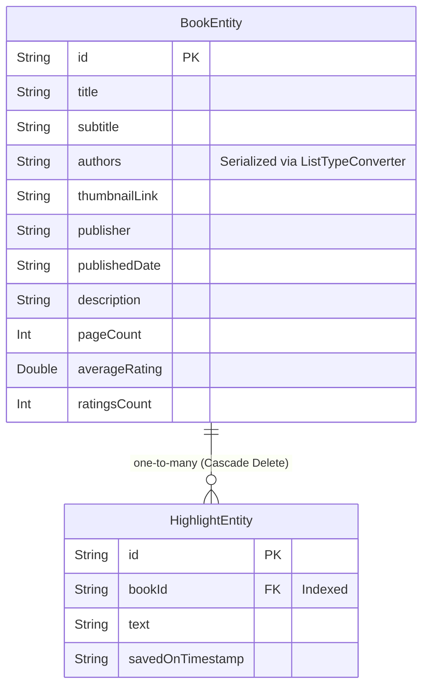

# Database Schema & Local Persistence

Prose leverages an offline-first architecture. Local data persistence is managed by Room Database, acting as the single source of truth for bookshelf content and highlights.

---

## Room Schema Configuration

The database configuration is declared in [BookDatabase](../core-db/src/main/java/com/sriniketh/core_db/BookDatabase.kt):
* **Database Version**: `1`
* **Entities**: `BookEntity`, `HighlightEntity`
* **Schema Exporting**: Enabled (`exportSchema = true`), creating `.json` files representing schemas in the `schemas/` directory to facilitate future migrations.

---

## Entities & Relationships



### [BookEntity](../core-db/src/main/java/com/sriniketh/core_db/entity/BookEntity.kt)
Represents a physical or digital book saved on the user's shelf.
* **Primary Key**: `id` (maps to Google Play Books volume ID).
* **Lists Serialization**: Room does not support storing collections of strings directly. The [ListTypeConverter](../core-db/src/main/java/com/sriniketh/core_db/converters/ListTypeConverter.kt) automatically serializes `authors: List<String>` into a delimiter-split string (`|`) for database storage and deserializes it when querying:
  ```kotlin
  class ListTypeConverter {
      private val delimiter = "|"
      @TypeConverter
      fun fromList(list: List<String>): String = list.joinToString(delimiter)
      @TypeConverter
      fun toList(string: String): List<String> = string.split(delimiter)
  }
  ```

### [HighlightEntity](../core-db/src/main/java/com/sriniketh/core_db/entity/HighlightEntity.kt)
Represents a text quote cropped and captured from a parent book.
* **Foreign Key**: A foreign key links `bookId` directly to `BookEntity(id)`.
* **On Delete Cascade**: Set to `ForeignKey.CASCADE`. When a user deletes a book from their bookshelf, all associated highlight entries are automatically deleted from the SQLite DB.
* **Performance Index**: An index is placed on the `bookId` field to optimize query execution times when loading highlights for a specific book.

---

## Data Access Objects (DAOs)

### [BookDao](../core-db/src/main/java/com/sriniketh/core_db/dao/BookDao.kt)
Performs bookshelf management operations:
* `@Insert(onConflict = OnConflictStrategy.IGNORE)`: Guarantees duplicate books cannot be inserted.
* `@Query("SELECT * FROM bookEntity")`: Exposes the bookshelf list as a reactive Flow stream.
* `@Delete`: Deletes the book entity (which cascades to highlights).

### [HighlightDao](../core-db/src/main/java/com/sriniketh/core_db/dao/HighlightDao.kt)
Performs highlight management operations:
* `@Insert(onConflict = OnConflictStrategy.REPLACE)`: Inserts new highlights or saves edits to existing ones.
* `@Query("SELECT * FROM highlightEntity WHERE bookId = :bookId")`: Retrieves all highlights for a book as a reactive Flow stream.

---

## Data Layer Mapping

Database entities reside inside `core-db` to shield features from raw SQLite implementation details. The `core-data` module provides extension functions in the `transformers/` package to convert Room entities into clean Kotlin models before VM exposure:

* [BookEntity.asBook()](../core-data/src/main/java/com/sriniketh/core_data/transformers/BookEntity.kt) maps [BookEntity](../core-db/src/main/java/com/sriniketh/core_db/entity/BookEntity.kt) to [Book](../core-models/src/main/java/com/sriniketh/core_models/book/Book.kt).
* [HighlightEntity.asHighlight()](../core-data/src/main/java/com/sriniketh/core_data/transformers/HighlightEntity.kt) maps [HighlightEntity](../core-db/src/main/java/com/sriniketh/core_db/entity/HighlightEntity.kt) to [Highlight](../core-models/src/main/java/com/sriniketh/core_models/book/Highlight.kt).
