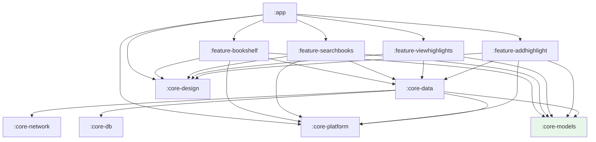

# Modules & Dependency Graph

Prose is split into **7 core modules** and **4 feature modules**, assembled by the `app` module. The
split enforces the layering described in [architecture.md](architecture.md): features depend on
`core-data` for everything data-related and never reach a data source directly.

All modules are listed in [`settings.gradle.kts`](../settings.gradle.kts).

## Dependency graph



`core-network`, `core-db`, `core-design`, and `core-platform` have **no internal module
dependencies**; `core-models` is a pure Kotlin/JVM library (highlighted above).

Text form (who each module `implementation`-depends on):

```
app                  → core-design, core-platform, feature-bookshelf,
                       feature-searchbooks, feature-viewhighlights, feature-addhighlight
feature-bookshelf    → core-design, core-data, core-models, core-platform
feature-searchbooks  → core-design, core-data, core-models, core-platform
feature-viewhighlights → core-design, core-data, core-models   (core-platform is test-only)
feature-addhighlight → core-design, core-data, core-models, core-platform
core-data            → core-network, core-db, core-platform, core-models
core-network         → (none internal)
core-db              → (none internal)
core-design          → (none internal)
core-platform        → (none internal)
core-models          → (none — pure Kotlin/JVM)
```

Key invariants:
- **`core-data` is the only module that depends on `core-network` and `core-db`.** Features cannot
  see Retrofit or Room types.
- **`core-models` has no Android dependency**, so domain logic and transformers stay pure and fast to
  test.
- **Feature modules do not depend on each other.** Cross-feature navigation is mediated by `app`.

---

## Core modules

### `core-models`
Pure Kotlin library (`java-library`, `kotlin-jvm`). Domain types only: `Book`, `BookInfo`,
`Highlight`, `BookSearch`. No DI, no Android.

### `core-platform`
Android OS abstractions that keep upper layers testable and `Context`-free.
- [`FileSource`](../core-platform/src/main/java/com/sriniketh/core_platform/FileSource.kt) — create /
  write / delete files (interface here; impl in `app`).
- [`DateTimeSource`](../core-platform/src/main/java/com/sriniketh/core_platform/DateTimeSource.kt) —
  injectable `now()` (impl + Hilt binding here).
- [`UriExtensions`](../core-platform/src/main/java/com/sriniketh/core_platform/UriExtensions.kt) —
  `encodeUri()`, `decodeUri()`, `buildHttpsUri()`.
- [`LogExtensions`](../core-platform/src/main/java/com/sriniketh/core_platform/LogExtensions.kt) —
  `logTag()`.

### `core-network`
Retrofit 3 + kotlinx.serialization client for the Google Books API.
- [`BooksApi`](../core-network/src/main/java/com/sriniketh/prose/core_network/retrofit/BooksApi.kt) —
  `GET books/v1/volumes` (search) and `GET books/v1/volumes/{id}` (detail).
- [`BooksRemoteDataSource`](../core-network/src/main/java/com/sriniketh/prose/core_network/BooksRemoteDataSource.kt)
  — thin wrapper that injects the API key and `projection=lite` for search.
- [`Volumes`](../core-network/src/main/java/com/sriniketh/prose/core_network/model/Volumes.kt) — DTOs
  with defaulted/nullable fields; JSON parsed with `ignoreUnknownKeys = true`.
- **API key:** `BOOKS_API_KEY` is read from `core-network/apikey.properties` into `BuildConfig` at
  build time. `HttpLoggingInterceptor` logs bodies only in debug.

### `core-db`
Room database `book-db`.
- [`BookDatabase`](../core-db/src/main/java/com/sriniketh/core_db/BookDatabase.kt) — version 1,
  `exportSchema = true` (schemas under `core-db/schemas`).
- [`BookEntity`](../core-db/src/main/java/com/sriniketh/core_db/entity/BookEntity.kt) and
  [`HighlightEntity`](../core-db/src/main/java/com/sriniketh/core_db/entity/HighlightEntity.kt). The
  highlight has a **foreign key to the book with `ON DELETE CASCADE`** and an index on `bookId`, so
  deleting a book removes its highlights.
- [`BookDao`](../core-db/src/main/java/com/sriniketh/core_db/dao/BookDao.kt) (insert IGNORE,
  observe-all `Flow`, exists, get-by-id, delete) and
  [`HighlightDao`](../core-db/src/main/java/com/sriniketh/core_db/dao/HighlightDao.kt) (insert
  REPLACE, get-by-id, observe-for-book `Flow`, delete-by-id).
- [`ListTypeConverter`](../core-db/src/main/java/com/sriniketh/core_db/converters/ListTypeConverter.kt)
  — stores `List<String>` (authors) as a `|`-delimited string.
- The database is built with `fallbackToDestructiveMigration(dropAllTables = true)` — schema changes
  drop and recreate rather than migrate.

### `core-design`
Compose design system: `AppTheme` (Material 3 + dynamic color), shared components
(`ProseTopAppBar`, `NavigationBack`, `Placeholder`), typography, animation specs, and the shared
transition `CompositionLocals`. No internal deps.

### `core-data`
Repositories, use cases, transformers, and the export DTOs
([`HighlightsExport`](../core-data/src/main/java/com/sriniketh/core_data/models/HighlightsExport.kt)).
This is the bridge between data sources and presentation. See
[architecture.md](architecture.md#repository--domain--core-data) for the type breakdown and
[flows.md](flows.md) for how each use case is invoked.

**Use cases** (in [`usecases/`](../core-data/src/main/java/com/sriniketh/core_data/usecases)):

| Use case | Backed by | Used in flow |
|----------|-----------|--------------|
| `SearchForBookUseCase` | `BooksRepository.searchForBooks` | Search |
| `FetchBookInfoUseCase` | `BooksRepository.fetchBookInfo` | Book info |
| `IsBookInDbUseCase` | `BooksRepository.doesBookExistInDb` | Book info |
| `AddBookToShelfUseCase` | `BooksRepository.insertBookIntoDb` | Add book |
| `GetAllSavedBooksUseCase` | `BooksRepository.getAllSavedBooksFromDb` | Bookshelf |
| `DeleteBookUseCase` | `BooksRepository.deleteBookFromDb` | (book removal) |
| `GetAllSavedHighlightsUseCase` | `HighlightsRepository.getAllHighlightsForBookFromDb` | View highlights |
| `SaveHighlightUseCase` | `HighlightsRepository.insertHighlightIntoDb` | Save highlight |
| `LoadHighlightUseCase` | `HighlightsRepository.loadHighlightFromDb` | Edit highlight |
| `DeleteHighlightUseCase` | `HighlightsRepository.deleteHighlightFromDb` | View highlights |
| `ExportHighlightsUseCase` | both repos + `FileSource` | Export/share |
| `CreateTempImageFileUseCase` | `FileSource.createNewFile` | Capture |
| `DeleteFileUseCase` | `FileSource.deleteFile` | Capture / OCR cleanup |
| `FormatCurrentDateTimeUseCase` | `DateTimeFormatter` | Save highlight |

---

## Feature modules

Each feature module owns Compose screens + ViewModels + feature DI. ViewModels are `@HiltViewModel`
and consume `core-data` use cases.

### `feature-bookshelf`
Home screen. [`BookshelfViewModel`](../feature-bookshelf/src/main/java/com/sriniketh/feature_bookshelf/BookshelfViewModel.kt)
streams saved books from the DB and shows the "book added" confirmation.

### `feature-searchbooks`
Two screens: search and book detail.
- [`SearchBookViewModel`](../feature-searchbooks/src/main/java/com/sriniketh/feature_searchbooks/SearchBookViewModel.kt)
  — debounced search-as-you-type with stale-result cancellation.
- [`BookInfoViewModel`](../feature-searchbooks/src/main/java/com/sriniketh/feature_searchbooks/BookInfoViewModel.kt)
  — fetches detail and adds to the shelf.

### `feature-viewhighlights`
[`ViewHighlightsViewModel`](../feature-viewhighlights/src/main/java/com/sriniketh/feature_viewhighlights/ViewHighlightsViewModel.kt)
— lists, deletes, and exports/shares a book's highlights; also routes the camera-permission result.

### `feature-addhighlight`
The most involved feature (camera, crop, OCR, save).
- [`CaptureAndCropImageViewModel`](../feature-addhighlight/src/main/java/com/sriniketh/feature_addhighlight/CaptureAndCropImageViewModel.kt)
  — temp-file lifecycle + capture→crop state machine.
- [`EditAndSaveHighlightViewModel`](../feature-addhighlight/src/main/java/com/sriniketh/feature_addhighlight/EditAndSaveHighlightViewModel.kt)
  — runs OCR, edits, and persists.
- [`TextAnalyzer`](../feature-addhighlight/src/main/java/com/sriniketh/feature_addhighlight/TextAnalyzer.kt)
  — ML Kit on-device Latin recognizer. Depends on `mlkit-text-recognition` and `cropify`.

---

## The `app` module
Single-Activity host. Owns:
- [`ProseApplication`](../app/src/main/java/com/sriniketh/prose/ProseApplication.kt) (`@HiltAndroidApp`).
- [`MainActivity`](../app/src/main/java/com/sriniketh/prose/MainActivity.kt) (`@AndroidEntryPoint`, edge-to-edge).
- The navigation graph ([`ProseAppScreen.kt`](../app/src/main/java/com/sriniketh/prose/ProseAppScreen.kt),
  [`Navigation.kt`](../app/src/main/java/com/sriniketh/prose/Navigation.kt)).
- App-level file plumbing: [`FileSourceImpl`](../app/src/main/java/com/sriniketh/prose/files/FileSourceImpl.kt),
  [`ProseFileProvider`](../app/src/main/java/com/sriniketh/prose/files/ProseFileProvider.kt), and the
  `${applicationId}.fileProvider` declaration in
  [`AndroidManifest.xml`](../app/src/main/AndroidManifest.xml) (paths in `res/xml/file_paths.xml`,
  rooted at the cache dir). The manifest also declares the ML Kit OCR dependency meta-data.
