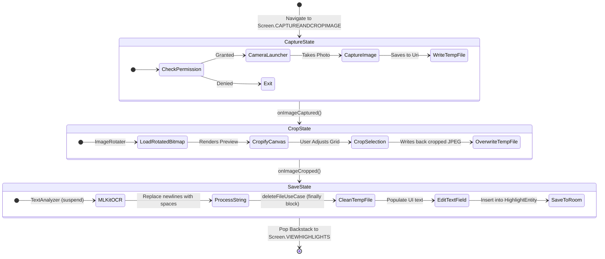

# OCR & Highlight Capture Flow

This document details the on-device Optical Character Recognition (OCR) pipeline, state management, and file lifecycle used to capture, crop, and save book highlights from physical images.

## End-to-End Workflow

The highlight capture feature is split into three main states orchestrated via Jetpack Compose and Navigation components:



---

## 1. Capture State (`CaptureAndCropImageScreen`)

The entry point is [CaptureAndCropImageScreen](../feature-addhighlight/src/main/java/com/sriniketh/feature_addhighlight/CaptureAndCropImageScreen.kt).

* **Launcher**: It uses `rememberLauncherForActivityResult` with `ActivityResultContracts.TakePicture()` to launch the camera application.
* **Temp File Creation**: The launch requires a destination file `Uri`. This is supplied by [CaptureAndCropImageViewModel](../feature-addhighlight/src/main/java/com/sriniketh/feature_addhighlight/CaptureAndCropImageViewModel.kt), which invokes [CreateTempImageFileUseCase](../core-data/src/main/java/com/sriniketh/core_data/usecases/CreateTempImageFileUseCase.kt) during initialization.
* **State Preservation**: The generated `Uri` is stored in the `SavedStateHandle` to preserve state across system configuration changes (such as device rotation).
* **Cancellation Cleanup**: If the user exits or cancels the camera, `onCleared()` in the ViewModel invokes [DeleteFileUseCase](../core-data/src/main/java/com/sriniketh/core_data/usecases/DeleteFileUseCase.kt) to clean up the unused temporary file, preventing file accumulation.

---

## 2. Crop State (`CropImageScreen`)

Once captured, the screen transitions to [CropImageScreen](../feature-addhighlight/src/main/java/com/sriniketh/feature_addhighlight/CropImageScreen.kt).

* **Rotation Correction**: Android cameras often output photos in landscape format with EXIF metadata defining the orientation. To ensure text recognition runs upright, [ImageRotater](../feature-addhighlight/src/main/java/com/sriniketh/feature_addhighlight/ImageRotater.kt) reads EXIF tags and rotates the raw Bitmap accordingly on `Dispatchers.IO` before displaying.
* **Cropping Canvas**: The UI integrates `Cropify` to present an adjustable cropping frame over the rotated bitmap.
* **Result Overwrite**: When the user clicks the check button:
  1. The cropped image bitmap is converted back to an Android bitmap.
  2. The cropped image is compressed as a JPEG (100% quality) and written back to the *same* temporary `Uri` via `context.contentResolver.openOutputStream(imageUri)`.
  3. The flow triggers `onImageCropped()` to progress forward.

---

## 3. Save State & OCR Processing (`EditAndSaveHighlightScreen`)

The app navigates to [EditAndSaveHighlightScreen](../feature-addhighlight/src/main/java/com/sriniketh/feature_addhighlight/EditAndSaveHighlightScreen.kt) passing the encoded `imageUri`.

* **ML Kit Text Extraction**: Under the hood, [TextAnalyzerImpl](../feature-addhighlight/src/main/java/com/sriniketh/feature_addhighlight/TextAnalyzer.kt) processes the image:
  ```kotlin
  val recognizer = TextRecognition.getClient(TextRecognizerOptions.DEFAULT_OPTIONS)
  val image = InputImage.fromFilePath(appContext, uri)
  recognizer.process(image)
  ```
  This operates asynchronously as a coroutine via `suspendCancellableCoroutine`.
* **Cleanup Strategy**: The temporary image file must be deleted immediately after OCR processing to save local device storage. This is done inside a `finally` block in [EditAndSaveHighlightViewModel.processImageForHighlightText](../feature-addhighlight/src/main/java/com/sriniketh/feature_addhighlight/EditAndSaveHighlightViewModel.kt):
  ```kotlin
  try {
      val visionText = textAnalyzer.analyzeImage(uri)
      val highlightText = visionText.text.replace("\n", " ")
      _uiState.update { it.copy(isLoading = false, highlightText = highlightText) }
  } finally {
      deleteFileUseCase(uri) // Deletes the temporary file
  }
  ```
* **Text Formatting**: ML Kit results preserve physical line breaks. Prose replaces all `\n` characters with spaces (` `) to convert the multi-line visual crop into a contiguous paragraph.
* **User Refinement**: The extracted text is displayed in a `BasicTextField`, allowing the user to correct misread words before saving.
* **Save to DB**: Clicking save invokes [SaveHighlightUseCase](../core-data/src/main/java/com/sriniketh/core_data/usecases/SaveHighlightUseCase.kt) to insert the highlight into the database, then pops navigation back to the highlights list screen.
